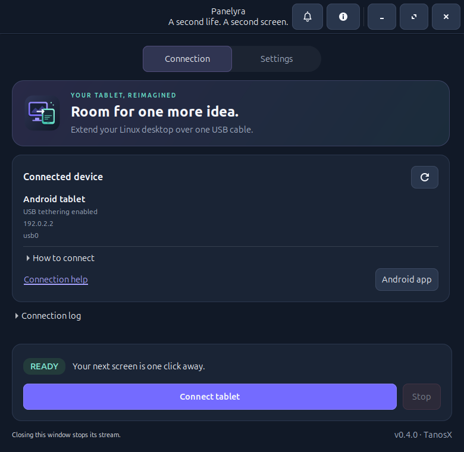

<p align="center">
  
</p>

# Panelyra

**Give your Android tablet a second life as a USB display for GNOME.**

[Русская документация](docs/README.ru.md) · [User guide](docs/usage.md) · [Troubleshooting](docs/troubleshooting.md) · [Distribution](docs/distribution.md)

Panelyra extends your Linux desktop onto an Android tablet. Move windows onto the
tablet and keep using your PC's mouse and keyboard. A native Linux window and a
CLI share the same video engine; a small Android app receives the picture.

- A real additional monitor in the current GNOME Wayland session.
- A direct USB connection through **USB tethering**, without root, Wi-Fi or USB debugging.
- Optional ADB transport for devices with USB debugging enabled.
- Linux controls for resolution, frame rate and quality, plus CLI diagnostics.
- English/Russian Android interface follows the Linux app's language; before its
  first sync, it follows the tablet's system language.
- H.264 video decoded through Android MediaCodec, with bounded queues to limit latency.
- No account, cloud relay, advertising or telemetry.
- Automatic display reconnection after unlocking GNOME, with an animated local
  lock screen: a glowing orb, drifting particles and the PC's local clock.
- Optional GNOME 50 extension to return still-open tablet windows after unlocking.
- One-button control of Internet access through the tablet, without stopping the
  USB display. The previous route and DNS settings can be restored.
- A Linux notification bell for new versions and developer news, with optional
  GitHub checks once the public source is configured.



## Status and compatibility

**0.4.0 is a pre-release preparation, not an App Center listing.** Source, package
recipes and documentation are provided in the [public repository](https://github.com/tanosxx/panelyra).
Signed release artifacts and store approval are separate release steps; see the
[distribution guide](docs/distribution.md).

The notification source is not configured in this unpublished build, so the
bell makes no Internet requests. USB display sharing works offline. The
[news guide](docs/notifications.md) explains how a publisher enables the source
and sends messages through the repository.

| Component | Current scope |
| --- | --- |
| Linux desktop | Tested on Ubuntu 26.04, GNOME 50.1, Wayland |
| Android device | Video transport tested on Lenovo Tab M10 FHD Plus, TB-X606X, Android 10 |
| Default mode | 1600 × 1000; up to 30 transmitted frames/s; 60 Hz capture; constant quality QP 18 |
| Android minimum | Declared minimum Android 4.4 / API 19; other devices and OS versions need testing |
| Other desktops | X11, KDE and other compositors are not supported by this backend |

The default mode was confirmed visually on the Lenovo: cursor movement works,
quality remains stable during motion and video is smoother than the original
20 fps mode. This is not a measured end-to-end latency or sustained frame-rate
guarantee. The redesigned 0.3.0 Android UI needs a new physical-device check.

Audio, touch input, clipboard sync and background Android operation are not
implemented. The tablet must stay unlocked with Panelyra in the foreground.
H.264 uses lossy 4:2:0 video, so small colored text can differ from a native monitor.

## Install from source

Download or clone this source tree, then open a terminal in its root directory.
On Ubuntu, install the runtime dependencies:

```bash
sudo apt install python3 python3-gi python3-cairo python3-gi-cairo \
  gir1.2-gtk-3.0 gir1.2-gstreamer-1.0 gstreamer1.0-pipewire \
  gstreamer1.0-plugins-base gstreamer1.0-plugins-good gstreamer1.0-plugins-ugly \
  iproute2 network-manager desktop-file-utils xdg-user-dirs
```

ADB is optional: `sudo apt install adb`. Run Panelyra as your normal desktop user,
inside a GNOME Wayland session, **without sudo**. Distribution packages are
required for PyGObject and GStreamer; a plain `pip install` is not sufficient.

Start the Linux application:

```bash
./panelyra gui
```

To add the source checkout to the applications menu and desktop:

```bash
/usr/bin/python3 scripts/install-launcher.py
```

Keep the checkout in the same location afterwards, because these shortcuts refer
to it. For a system package, see [building and installing a .deb](docs/distribution.md).

## Restore windows after unlocking

GNOME removes the virtual monitor when locking the desktop. Panelyra keeps showing
its local lock animation and creates the monitor again after unlocking. Without
an extension, GNOME may leave its windows on the main display.

The optional **Panelyra Window Restore** extension for **GNOME 50** remembers
still-open windows before locking and returns them after the monitor's layout
has been restored. It restores their position, size, workspace, maximized or
fullscreen state, and minimized state. Install it once as your normal desktop
user, **without sudo**, from this checkout:

```bash
/usr/bin/python3 scripts/install-window-extension.py --check
/usr/bin/python3 scripts/install-window-extension.py
```

For a `.deb` installation, the equivalent installer is bundled at:

```bash
/usr/bin/python3 /usr/share/panelyra/scripts/install-window-extension.py
```

**Log out of GNOME and log in again once** so Shell discovers the new local
extension. Then start the updated Panelyra on the PC and reconnect the tablet.
No Android update is needed. The installer leaves global extension settings
alone; if user extensions are disabled in GNOME, it reports that limitation.
Python wheels do not bundle the Shell extension: use the source checkout to
install it alongside a wheel-based setup.

This restores existing windows; it does not keep the actual monitor alive during
locking, reopen closed applications or restore application-internal state. A
changed display setup or unavailable original mode/scale skips restoration.
Applications can constrain their window sizes, and tiling extensions may impose
their own layout. Try a lock/unlock cycle with your usual applications.

To return to display reconnection without window restoration:

```bash
gnome-extensions disable panelyra-windows@tanosx.github.io
```

Updating an existing helper saves its previous directory under `backups/` in a
writable checkout, or under `$XDG_DATA_HOME/panelyra/backups` (normally
`~/.local/share/panelyra/backups`) for a system installation. The installer prints
the exact path. Changed extension code also needs a logout/login to load.

## Connect your tablet

1. Connect a data-capable USB cable and enable **USB tethering** in Android's
   hotspot/tethering settings. Internet access through the tablet is not required.
2. Install or update the Android companion. In the Linux window, click
   **Android app**, select the APK and click **Start server**. Open the displayed
   address **in the tablet's browser**, download the APK and install it over the
   existing app. The page has an English/Russian switch. Allow installation from
   that browser if Android asks, then open Panelyra on the tablet.

   For a local test APK, follow [the Android build instructions](android/README.md).
   The same download server is available from the CLI:

   ```bash
   ./panelyra serve-apk --apk out/panelyra-0.4.0-android-debug.apk
   ```

   The local server serves only the APK and its landing page. Use **Stop server**
   in the GUI or Ctrl+C in the CLI afterwards; it also stops after its time limit.
   Alternatively, copy the APK using MTP and install it from Android's Files app.
3. Open **Panelyra** on the tablet. It should show a USB connection address.
4. Open **Panelyra** on Linux and connect. Or use the CLI:

   ```bash
   ./panelyra start --transport usb --wait 120
   ```

5. In GNOME **Settings → Displays**, arrange the new monitor beside your main
   display. Move a window onto it with the mouse or `Super+Shift+Left/Right`.

If enabling tethering changes the PC's Internet route, run
`./panelyra configure-usb`. This temporarily removes the tablet's default route
and DNS contribution while preserving the USB link. It does not edit the saved
NetworkManager profile; repeat after reconnecting if needed.

The APK above is signed with a **local debug key for testing**, not a production
release key. Do not upload debug signing keys or local backups to GitHub.

## CLI

Use `./panelyra` from a checkout, or `panelyra` after installing the Linux package.

```bash
./panelyra --version
./panelyra doctor --transport usb
./panelyra profiles
./panelyra start
./panelyra start --profile economy
./panelyra start --width 1600 --height 1000 --fps 30 --capture-fps 60 --quality 18
./panelyra start --stats
./panelyra start --language ru
./panelyra status
./panelyra stop
```

`start` prefers a detected USB tether, falling back to ADB. Ctrl+C stops a CLI
session and removes its virtual monitor. Closing the GUI stops the stream it
started. Resolution and frame-rate changes apply to the next connection.
The CLI uses profile defaults and explicit flags; it does not inherit saved GUI
preferences. `gui --no-connect` opens the settings without starting a stream.
The GUI sends its language when connecting and applies language changes during
its active stream. CLI `start --language en|ru|auto` can also set the Android
language; omitting the option keeps the tablet's saved or system language.

For all options, use `./panelyra --help` and `./panelyra start --help`.
The legacy `./usb-display` entry point remains available for existing scripts.
See the [user guide](docs/usage.md) for ADB, multiple devices and quality tuning.

## How it works

```text
GNOME virtual monitor → PipeWire → H.264 encoder → USB TCP → Android MediaCodec
```

Mutter creates an additional monitor; its picture and cursor are captured locally
and encoded on the PC. Android decodes the stream directly onto a SurfaceView.
The default capture runs at 60 Hz and excess raw frames are dropped before
encoding to keep delivery at up to 30 fps. A still desktop may send fewer frames.

The backend uses private Mutter D-Bus APIs. GNOME upgrades may require changes.
The protocol has no application-level encryption or authentication: use your own
direct USB connection. The receiver binds only to the detected USB interface or
ADB loopback, never to Wi-Fi or all network interfaces.

## Documentation and development

- [User guide and CLI reference](docs/usage.md)
- [Troubleshooting and useful diagnostics](docs/troubleshooting.md)
- [Architecture and cursor workaround](docs/architecture.md)
- [UTD1 wire protocol](docs/protocol.md)
- [Development, tests and release checks](docs/development.md)
- [Android build and signing](android/README.md)
- [Linux packaging and publication](docs/distribution.md)
- [GitHub publication guide](docs/github.md)
- [Update notices and publishing developer news](docs/notifications.md)
- [Store listing copy](docs/store-listing.md)
- [Privacy](docs/privacy.md), [security policy](SECURITY.md), [contributing](CONTRIBUTING.md)
- [Changelog](CHANGELOG.md)

Quick source checks:

```bash
/usr/bin/python3 -m unittest discover -s tests -v
gjs -m tests/window-restore-tests.js
/usr/bin/python3 scripts/smoke_test.py --width 1600 --height 1000 \
  --fps 30 --capture-fps 60 --quality 18
```

The video smoke test also needs `gstreamer1.0-libav`. It uses a synthetic picture
and a local receiver, so no tablet or screen capture is needed. A successful
local decode is not a substitute for checking a real Android device.
The GJS policy checks simulate windows and monitor changes; they do not lock or
modify the current desktop and do not replace a real GNOME lock/unlock check.

## License

Copyright © 2026 **TanosX**. Panelyra source code, documentation and original icons
are provided under the [MIT License](LICENSE). Third-party runtimes and codecs
retain their own licenses; this project does not relicense them.
