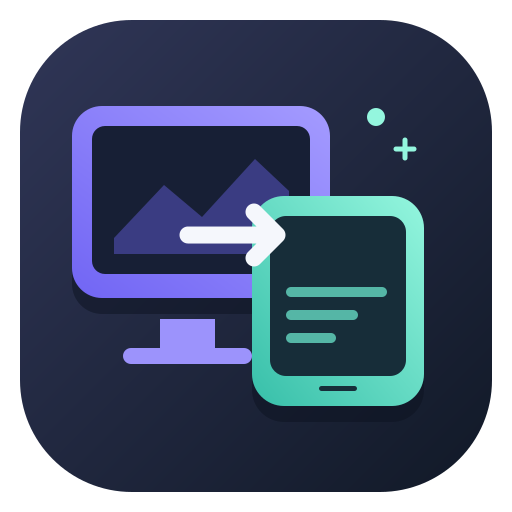
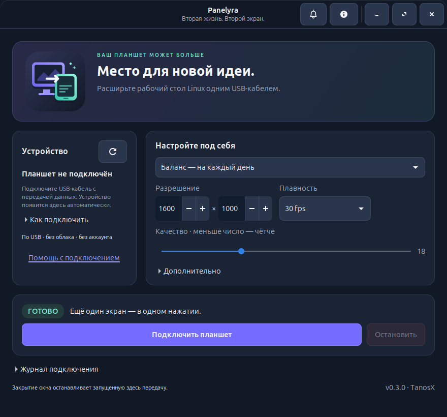

<p align="center">
  
</p>

# Panelyra

**Android-планшет как второй экран GNOME по USB.**

[English](../README.md) · [Подробное руководство](usage.md) · [Решение проблем](troubleshooting.md) · [Пакеты и публикация](distribution.md)

Panelyra добавляет монитор к рабочему столу Linux. Перетаскивайте на планшет окна
и работайте мышью и клавиатурой ПК. В Linux доступны графическое окно и CLI,
на Android — небольшое нативное приложение с системным H.264-декодером.

- Подключение через **USB-модем**, без root, Wi-Fi и режима разработчика.
- Дополнительный вариант через ADB, если отладка по USB доступна.
- Настройка разрешения, частоты кадров и качества на ПК.
- Русский или английский интерфейс Android по выбору в Linux; до первой передачи
  этой настройки используется язык системы планшета.
- Без регистрации, облачного сервера, рекламы и телеметрии.
- Колокольчик в Linux для новых версий и новостей разработчика; проверки GitHub
  можно отключить.



## Состояние проекта

**Версия 0.3.0 подготовлена к дальнейшему выпуску; в Центре приложений она пока
не опубликована.** В проекте есть исходники, документация и средства сборки
пакетов. Публичный репозиторий, релизная подпись и принятие магазином — отдельные
этапы, описанные в [инструкции по распространению](distribution.md).

| Компонент | Что проверено |
| --- | --- |
| Linux | Ubuntu 26.04, GNOME 50.1, Wayland |
| Планшет | Lenovo Tab M10 FHD Plus / TB-X606X, Android 10 |
| Рабочий режим | 1600 × 1000; передача до 30 кадров/с; захват 60 Гц; QP 18 |
| Минимальная версия Android | В сборке заявлена Android 4.4 / API 19; другие устройства требуют проверки |
| Другие рабочие столы | X11, KDE и другие композиторы текущим способом захвата не поддерживаются |

На Lenovo подтверждены работающий курсор, стабильное качество при движении и
улучшение плавности видео после перехода с 20 на 30 кадров/с и захвата на 60 Гц.
Задержка и длительная частота показа на планшете количественно не измерены.
Обновлённому интерфейсу Android 0.3.0 ещё нужна проверка на физическом устройстве.

В Linux блок **«Устройство»** автоматически показывает обнаруженный планшет,
состояние USB-модема и его адрес. Список также можно обновить кнопкой со стрелкой.
Название берётся из сведений USB: некоторые планшеты сообщают только общее имя
Android. Наличие USB-соединения ещё не означает, что приложение-приёмник открыто.

При блокировке компьютера на планшете появляется анимированная заставка:
светящаяся сфера, плавно движущиеся частицы и часы с местным временем ПК.
Если Cairo недоступен, используется статичная заставка «Экран заблокирован».
После разблокировки Panelyra автоматически создаёт второй экран заново и
пытается вернуть его расположение, если остальные мониторы не изменились.
Для самого переподключения расширение GNOME не нужно. Чтобы вернуть окна с
основного монитора автоматически, можно установить дополнительное расширение
GNOME 50 по инструкции ниже. Обновлять Android-приложение не требуется.
После обновления исходников один раз перезапустите Panelyra на ПК.

Колокольчик сверху открывает список уведомлений и показывает число непрочитанных.
В нём можно обновить список, отметить всё прочитанным и отключить автоматические
проверки. После настройки публичного источника программа проверяет GitHub при
открытом окне примерно раз в шесть часов и при запуске, если срок проверки уже
наступил. Ссылки открываются по нажатию; обновления не скачиваются и не
устанавливаются автоматически. **Пока репозитория нет, источник не настроен и
сетевых запросов за новостями нет.** Передача изображения по USB работает без
Интернета. [Как публиковать версии и новости](notifications.md).

Звук, касания планшета, общий буфер обмена и работа Android-приложения в фоне
пока не реализованы. Планшет должен быть разблокирован, приложение — открыто.
Изображение сжимается H.264 4:2:0 с потерями; мелкий цветной текст может немного
отличаться от обычного монитора.

## Установка на Ubuntu

Скачайте исходники и откройте терминал в папке проекта. Установите зависимости:

```bash
sudo apt install python3 python3-gi python3-cairo python3-gi-cairo \
  gir1.2-gtk-3.0 gir1.2-gstreamer-1.0 gstreamer1.0-pipewire \
  gstreamer1.0-plugins-base gstreamer1.0-plugins-good gstreamer1.0-plugins-ugly \
  iproute2 network-manager desktop-file-utils xdg-user-dirs
```

ADB нужен только для альтернативного способа подключения: `sudo apt install adb`.
Запускайте программу от обычного пользователя в сеансе GNOME Wayland,
**без sudo**. PyGObject и GStreamer устанавливаются системными пакетами;
одного `pip install` недостаточно.

```bash
./panelyra gui
```

Чтобы добавить значок в меню приложений и на рабочий стол:

```bash
/usr/bin/python3 scripts/install-launcher.py
```

Не перемещайте папку после установки ярлыков: они ссылаются на неё.
Для системной установки есть [сборка .deb](distribution.md).

## Возврат окон после разблокировки

GNOME при блокировке удаляет виртуальный монитор. Дополнительное расширение
**Panelyra Window Restore** для **GNOME 50** запоминает открытые на планшете окна
до блокировки и возвращает их после восстановления экрана и его расположения.
Восстанавливаются положение, размер, рабочий стол, развёрнутое или полноэкранное
состояние, а также свёрнутые окна остаются свёрнутыми.

Один раз запустите установщик из папки исходников от обычного пользователя,
**без sudo**:

```bash
/usr/bin/python3 scripts/install-window-extension.py --check
/usr/bin/python3 scripts/install-window-extension.py
```

Если Panelyra установлена пакетом `.deb`, используйте включённый в пакет установщик:

```bash
/usr/bin/python3 /usr/share/panelyra/scripts/install-window-extension.py
```

**Один раз выйдите из сеанса GNOME и войдите снова**, чтобы оболочка обнаружила
новое локальное расширение. Затем запустите обновлённую Panelyra на ПК и подключите
планшет. Обновление Android не нужно. Если пользовательские расширения отключены
в GNOME, установщик сообщит об этом и сохранит общую настройку. В Python wheel
расширение оболочки не входит; для такой установки запускайте его установщик
из отдельно скачанных исходников.

Сам монитор на время блокировки по-прежнему исчезает. Возвращаются только ещё
открытые окна: закрытые приложения и их внутреннее состояние не воссоздаются.
При изменении состава мониторов или недоступности прежнего режима/масштаба
восстановление пропускается. Приложения могут ограничивать размеры своих окон,
а расширения для мозаичного размещения — применять собственную раскладку.
Проверьте блокировку и разблокировку с вашими обычными приложениями.

Чтобы оставить только автоматическое переподключение экрана, отключите расширение:

```bash
gnome-extensions disable panelyra-windows@tanosx.github.io
```

При обновлении расширения установщик сохраняет прежнюю папку в `backups/`
доступного для записи проекта, а для системной установки — в
`$XDG_DATA_HOME/panelyra/backups` (обычно `~/.local/share/panelyra/backups`).
Точный путь выводится при установке. Обновлённый код расширения тоже загружается
после выхода из сеанса и повторного входа.

## Подключение без отладки по USB

1. Подключите планшет кабелем с передачей данных. В настройках Android включите
   **USB-модем**: обычно «Сеть и Интернет → Точка доступа и модем».
   Интернет планшета для передачи изображения не нужен.
2. Установите или обновите Android-клиент. В окне Panelyra на ПК нажмите
   **«Приложение Android»**, выберите APK и нажмите **«Запустить сервер»**.
   Откройте показанный адрес **в браузере планшета**, скачайте APK и установите
   поверх старого приложения. Если Android попросит, разрешите установку из
   этого браузера. На странице скачивания есть переключатель RU / EN.

   Тестовый APK можно собрать по [инструкции Android](../android/README.md).
   Для запуска того же сервера из терминала:

   ```bash
   ./panelyra serve-apk --apk out/panelyra-0.3.0-android-debug.apk
   ```

   После установки нажмите **«Остановить сервер»** в окне программы или Ctrl+C
   в терминале. Также APK можно скопировать через MTP
   и установить из приложения «Файлы», затем включить USB-модем.
3. Откройте **Panelyra** на планшете. Должен появиться адрес USB-подключения.
4. Нажмите значок **Panelyra** на ПК и подключитесь. Для запуска из терминала:

   ```bash
   ./panelyra start --transport usb --wait 120
   ```

5. В Ubuntu откройте «Настройки → Дисплеи» и расположите новый экран рядом с
   основным. Окно можно перенести мышью или сочетанием `Super+Shift+←/→`.

Если USB-модем перехватил интернет ПК, выполните `./panelyra configure-usb`.
Команда временно убирает интернет-маршрут и DNS планшета, сохраняя локальную
связь по USB. Сохранённый профиль NetworkManager не меняется; после нового
подключения настройку при необходимости повторяют.

Тестовый APK подписан локальным отладочным ключом. Это не релизная подпись.
Ключи и личные резервные копии нельзя добавлять в публичный репозиторий.

## Графическое окно и CLI

В окне Linux выберите разрешение и режим качества, затем подключитесь.
Изменённые параметры применяются при следующем подключении. Остановка или
закрытие окна завершает запущенную из него передачу.

Язык меняется в **«Дополнительно → Язык»**. При подключении окно передаёт его
Android-приложению; во время запущенной из этого окна передачи язык на планшете
меняется сразу, без перезапуска видео. Вариант **«Язык системы»** передаёт язык
системы **ПК**: русский для русской локали, иначе английский. До первой полученной
настройки приложение Android следует языку системы **планшета** по тому же
правилу. Последнее значение с ПК сохраняется на планшете после закрытия приложения
и отключения кабеля. Чтобы снова следовать системе планшета до следующей передачи
настройки, очистите данные Panelyra в настройках Android.

В папке исходников используйте `./panelyra`, после установки пакета — `panelyra`:

```bash
./panelyra --version
./panelyra doctor --transport usb
./panelyra profiles
./panelyra start
./panelyra start --profile economy
./panelyra start --width 1600 --height 1000 --fps 30 --capture-fps 60 --quality 18
./panelyra start --stats
./panelyra start --language ru
./panelyra status
./panelyra stop
```

`start` автоматически выбирает обнаруженный USB-модем, иначе пробует ADB.
Ctrl+C останавливает передачу из терминала и удаляет созданный монитор.
Старое имя `./usb-display` сохранено для совместимости.

В CLI `start --language en`, `ru` или `auto` передаёт выбранный язык планшету;
`auto` использует язык системы ПК. Без этого параметра язык Android не меняется.
Окно Linux не управляет языком отдельной передачи, запущенной из терминала.
Для синхронизации нужен обновлённый Android-клиент; старые версии продолжат
принимать видео без смены языка.

Профили: `balanced` — 1600×1000, 30 кадров/с, QP 18; `economy` — 1280×800,
20 кадров/с, QP 20; `crisp` — 1600×1000, 30 кадров/с, QP 14. Захват во всех трёх
профилях — 60 Гц. Явно заданные параметры командной строки заменяют значения
профиля. CLI не читает сохранённые настройки окна: по умолчанию он использует
`balanced`. Окно сохраняет параметры в `~/.config/panelyra/settings.json`
(либо в `$XDG_CONFIG_HOME/panelyra/settings.json`).

Для открытия без подключения: `./panelyra gui --no-connect`. Язык окна также
можно задать через `gui --language ru` или `gui --language en`. Для программного чтения
состояния и профилей доступны `status --json` и `profiles --json`.

Все параметры: `./panelyra --help` и `./panelyra start --help`.
В [подробном руководстве](usage.md) описаны ADB, несколько планшетов и настройка
качества. Решения ошибок — в [диагностике](troubleshooting.md).

## Как устроено

```text
Виртуальный монитор GNOME → PipeWire → H.264 → TCP по USB → Android MediaCodec
```

При захвате 60 Гц лишние исходные кадры отбрасываются до кодирования, чтобы
планшет получал до 30 кадров/с. Неподвижный рабочий стол может обновляться реже.
Используется приватный D-Bus API Mutter: обновление GNOME может потребовать
адаптации программы. Поток не имеет отдельного шифрования и пароля; подключайте
свой планшет напрямую к доверенному ПК. Сервер не открывается на Wi-Fi.

## Разработка и документация

- [Архитектура](architecture.md), [протокол UTD1](protocol.md)
- [Сборка и тесты](development.md), [Android](../android/README.md)
- [Пакеты и публикация](distribution.md), [текст для магазина](store-listing.md)
- [Публикация на GitHub](github.md)
- [Уведомления и отправка новостей пользователям](notifications.md)
- [Приватность](privacy.md), [безопасность](../SECURITY.md)
- [Участие в проекте](../CONTRIBUTING.md), [история изменений](../CHANGELOG.md)

Быстрая проверка исходников:

```bash
/usr/bin/python3 -m unittest discover -s tests -v
gjs -m tests/window-restore-tests.js
/usr/bin/python3 scripts/smoke_test.py --width 1600 --height 1000 \
  --fps 30 --capture-fps 60 --quality 18
```

Для видеотеста нужен `gstreamer1.0-libav`. Тест передаёт синтетическое изображение
локальному приёмнику, без планшета и захвата рабочего стола. Он не заменяет
проверку аппаратного декодера Android.
Тесты GJS имитируют окна и изменение мониторов, не блокируют текущий рабочий стол
и не заменяют проверку настоящей блокировки и разблокировки GNOME.

## Лицензия

© 2026 **TanosX**. Исходники Panelyra, документация и оригинальные значки доступны
по лицензии [MIT](../LICENSE). Сторонние библиотеки и кодеки сохраняют свои лицензии.
