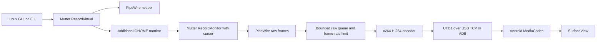

# Architecture

[Home](../README.md) · [Protocol](protocol.md) · [Development](development.md)

Panelyra has a Python Linux sender and a Java Android receiver. The Linux GTK
window launches the same CLI engine used from a terminal. Rendering and protocol
work stay outside the GUI event loop.

## Linux sender

`usbdisplay/host.py` owns the capture lifecycle. `RecordVirtual` creates a new
monitor in the current session. A small PipeWire consumer keeps that virtual
monitor active at the requested size and capture rate. The sender selects the
new matching virtual connector and obtains its actual video from a second
`RecordMonitor` session.

The selection excludes connectors present before startup and physical monitors.
It waits for a first keeper frame, and fails if more than one new monitor matches
instead of guessing which screen to capture. Shutdown closes the sender's
sessions and removes its own virtual monitor; permanent GNOME settings are not
changed by the capture backend.

`resume.py` watches GNOME lock state and treats the compositor's lock-time
capture shutdown separately from transport failures. It retains the USB socket
and sends an opaque, locally generated H.264 lock image while capture is closed.
After unlocking it recreates the monitor/cursor sessions, keeps the placeholder
running during PipeWire setup and switches back to desktop video. Encoder
restarts send new SPS/PPS/IDR while preserving increasing wire timestamps. A
bounded retry window covers delayed capture availability; Stop remains active.

`session.py` snapshots DisplayConfig state in memory during normal streaming.
Restoration uses fresh mode IDs and a temporary configuration, replacing only
the owned virtual connector. If another monitor's identity or available mode
changes, restoration is skipped. It does not save or reposition application
windows. GNOME's capture inhibition and normal screen lock remain in control.

The default raw pipeline copies pixels out of PipeWire's buffer pool and uses a
two-buffer leaky queue before encoding. `videorate` drops excess raw frames to
the requested transmission limit. H.264 output access units are not arbitrarily
dropped because later frames can depend on them.

The x264 encoder uses Baseline, zero-latency tuning, no B frames, one reference
frame and constant quantization QP 18 by default. I/P quantization is equal and
there is no VBV cap in this mode. A bitrate-controlled alternative is available
for explicit bandwidth constraints. It can produce visible quality variation.

## Cursor and capture

On the tested GNOME 50.1 system, direct `RecordVirtual` video updated while its
embedded cursor could remain frozen. The `RecordMonitor` path supplies an
embedded cursor and avoids that observed behavior. Its monitor capture also
uses a different readback path. The virtual stream remains a keeper, so the
design uses two local captures but only one encoder.

`--no-cursor-workaround` uses direct `RecordVirtual` capture for diagnosis. It
is not the tested everyday default. The workaround is scoped to the sessions
owned by Panelyra; it does not change global cursor settings or require a GNOME
restart. Upstream context is available in
[Mutter's cursor capture fix](https://github.com/GNOME/mutter/commit/4b852db14f1c8c882fbb7e58499ffe171c094d9d).

## USB transport

`network.py` checks Linux sysfs USB ancestry and driver information. It detects
RNDIS automatically; NCM/CDC Ethernet needs an explicit interface to avoid
mistaking an ordinary USB network adapter for a tablet. Peer addresses must be
in the selected subnet, and the outgoing route must use that USB interface.
The TCP socket binds to its USB address. ADB is an alternative transport using
a dynamically allocated forwarding port with explicit cleanup ownership.

`download.py` provides the optional short-lived APK server. It serves one
selected APK and a fixed landing page, with USB-address binding and peer checks.
Neither transport provides application-level peer authentication or encryption.
Read [SECURITY.md](../SECURITY.md) for the trust model.

## APK distribution over USB

`download.py` serves a snapshot of one selected APK and a local English/Russian
landing page. The HTTP listener binds to the selected USB IPv4 address and
accepts only that tablet and the local PC. `download_ui.py` owns the GUI server
and runs discovery, file loading and server lifecycle operations outside GTK's
event loop. Port, lifetime, APK path and USB-interface choice are saved with GUI
preferences. Starting the app does not start the server; sharing stops on user
request, expiry, loss of the selected USB connection or main-window closure.
`serve-apk` uses the same server from the CLI. No APK installation is automated.

## Android receiver

The application listens on the selected USB IPv4 interface, or loopback for ADB.
It validates the [UTD1 header and packet framing](protocol.md) and extracts the
initial SPS/PPS into MediaCodec's codec-specific configuration. It keeps other
NAL units from the initial access unit, including IDR slices.

Input and output use separate workers. Input buffers go to MediaCodec without
an unbounded application packet queue. When several decoded output frames are
ready, older decoded frames can be released without rendering so the latest
picture is shown. Dropping decoded frames does not break the H.264 reference
chain. Socket timeouts, parser errors and decoder failures close the current
connection. The foreground app can then accept a new connection.

The SurfaceView fits the picture to the panel while preserving aspect ratio.
The screen stays awake while displaying. Losing the surface or backgrounding
the app ends the session; there is no foreground service or background receiver.

The Android session also owns a language-control listener on TCP 27184, separate
from UTD1 video on 27183. It uses the same address binding and peer restrictions.
The GUI sends its resolved English/Russian choice on connection and when the
user changes it during a stream owned by that window; the CLI sends a choice
only with `start --language`. A missing control listener is nonfatal, preserving
video compatibility with older Android builds. Language changes update strings
without recreating the activity, SurfaceView or decoder. Android saves the last
valid choice and uses its own system locale until one has been received.

## Source map

| Path | Responsibility |
| --- | --- |
| `usbdisplay/__main__.py` | CLI validation and command dispatch |
| `usbdisplay/launcher.py` | Linux GTK UI and stream process lifecycle |
| `usbdisplay/settings.py`, `runtime.py` | Validated preferences, profiles and per-user stream ownership |
| `usbdisplay/host.py`, `cursor.py` | Capture, encode and session cleanup |
| `usbdisplay/network.py`, `adb.py` | USB transport discovery and connection |
| `usbdisplay/protocol.py` | Sender packet framing |
| `usbdisplay/download.py` | USB-scoped APK distribution |
| `android/app/src/main/java/dev/usbdisplay/client/` | Android receiver and decoder |
| `scripts/smoke_test.py`, `tests/`, `android/tests/` | Local regression checks |

The backend relies on private Mutter APIs, not a compositor-independent virtual
monitor portal. Relevant upstream references:
[Mutter ScreenCast interface](https://github.com/GNOME/mutter/blob/50.1/data/dbus-interfaces/org.gnome.Mutter.ScreenCast.xml),
[GStreamer x264enc](https://gstreamer.freedesktop.org/documentation/x264/index.html),
[Android MediaCodec](https://developer.android.com/reference/android/media/MediaCodec).
